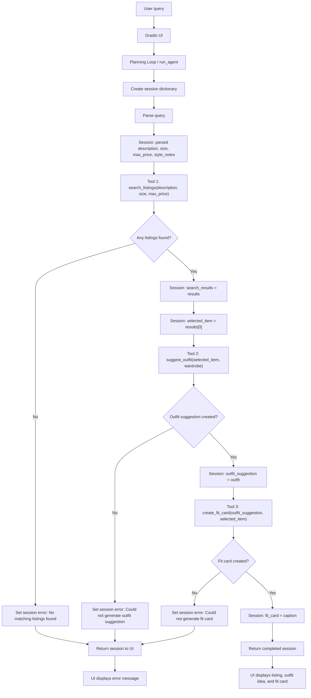

# FitFindr — planning.md

---

## Tools

### Tool 1: search_listings

**What it does:**
Searches the listings for items that match the user's requested item description, size, and maximum price. It is the discovery tool for the agent, so it must run before outfit styling or fit card generation

**Input parameters:**

- `description` (str): The item the user is looking for in keywords or a short phrase such as "vintage graphic tee".
- `size` (str): The user's requested size such as "S", "M", "L".
- `max_price` (float): The user's maximum price in dollars.

**What it returns:**
Returns a list[dict] of matching listing dictionaries. Each result dictionary should be one listing from data/listings.json and should include these fields: id, title, description, category, style_tags, size, condition, price, colors, brand, and platform.

**What happens if it fails or returns nothing:**
If no listings match after filtering and scoring, return an empty list [] instead of raising an exception. If no listings match, return an empty list `[]`. The planning loop should check `if not results:`, set `session["error"]` to a helpful no-results message, and return early without calling `suggest_outfit` or `create_fit_card`.

---

### Tool 2: suggest_outfit

**What it does:**
Creates one or two outfit suggestions using the selected listing and the user's wardrobe.

**Input parameters:**

- `new_item` (dict): The selected listing dictionary from search_listings, including item details such as title, description, category, style_tags, size, condition, price, colors, brand, and platform.
- `wardrobe` (dict): A wardrobe dictionary with an items key. wardrobe["items"] is a list of wardrobe item dictionaries. Each wardrobe item can include id, name, category, colors, style_tags, notes.

**What it returns:**
Returns a non-empty string containing styling advice. For a non-empty wardrobe, the string should include 1 to 2 complete outfits using the new item and named wardrobe items.

**What happens if it fails or returns nothing:**
The tool should return a general outfit suggestion instead of raising an exception. If the LLM call fails or the tool cannot generate a useful suggestion, it should return a fallback string like: "I could not generate a personalized outfit from the wardrobe, but this item would pair well with simple basics, balanced proportions, and shoes that match its style tags." The agent should store the returned string in session["outfit_suggestion"]

---

### Tool 3: create_fit_card

**What it does:**
Turns the selected listing and outfit suggestion into a shareable outfit caption. This is the final presentation tool which is used after the agent has already found an item and generated styling advice.

**Input parameters:**

- `outfit` (str): The outfit suggestion returned by suggest_outfit.
- `new_item` (dict): The selected listing dictionary from search_listings. It provides the item title, price, platform, colors, and style tags needed for the caption.

**What it returns:**
Returns a 2 to 4 sentence string that works as a casual fit card or social caption. The caption should mention the selected item, the price, and the platform, and it should summarize the outfit.

**What happens if it fails or returns nothing:**
The tool should return a descriptive error string such as: "Could not create a fit card because no outfit suggestion was provided." If new_item is missing or lacks critical fields like title, the agent should set session["error"] before calling this tool and return early. If the fit card result is empty, the agent should set session["error"] to explain that the listing was found and styled, but the fit card could not be generated.

---

## Planning Loop

**How does your agent decide which tool to call next?**
It uses a fixed planning loop: first it finds a listing, then it styles that listing, then it creates the fit card. It starts by creating a session, validating the query, and parsing the query into description, optional size, optional max_price, and optional style_notes. It then calls search_listings(description, size, max_price) and stores the result in session["search_results"]. If no results are found, the agent sets a helpful error message and returns early without calling the styling or fit card tools. If results exist, it selects results[0] as session["selected_item"], passes that item and the wardrobe into suggest_outfit, stores the returned outfit in session["outfit_suggestion"], then calls create_fit_card(outfit_suggestion, selected_item) and stores the result in session["fit_card"]. The loop is complete when the selected item, outfit suggestion, and fit card are all populated and session["error"] is still None.

---

## State Management

**How does information from one tool get passed to the next?**
The agent keeps track of each interaction with a session dictionary. That session stores the original query, the parsed search details, the search results, the item the agent picks, the wardrobe, the outfit suggestion, the fit card, and any error message. First, the parser saves the search fields. Then search_listings saves the matching listings. The agent chooses the first result as selected_item, passes it to suggest_outfit with the wardrobe, and then passes the outfit suggestion and selected item to create_fit_card. At the end, the UI reads the session and either shows the error message or displays the listing, outfit idea, and fit card.

---

## Error Handling

For each tool, describe the specific failure mode you're handling and what the agent does in response.

| Tool            | Failure mode                          | Agent response                                                                                                                                                                                                                                                        |
| --------------- | ------------------------------------- | --------------------------------------------------------------------------------------------------------------------------------------------------------------------------------------------------------------------------------------------------------------------- |
| search_listings | No results match the query            | Set `session["error"]` to `"No matching listings found for that item, size, and budget. Try broadening the description, removing the size filter, or increasing the max price."` Then return the session early without calling `suggest_outfit` or `create_fit_card`. |
| suggest_outfit  | Wardrobe is empty                     | Do not stop the agent. Generate general styling advice for the selected item instead of using named wardrobe pieces. Store that advice in `session["outfit_suggestion"]` and continue to `create_fit_card`.                                                           |
| create_fit_card | Outfit input is missing or incomplete | Set `session["error"]` to `"I found a listing, but could not create a fit card because the outfit suggestion was missing."` Then return the session early instead of generating a fit card.                                                                           |

---

## Architecture

---

## AI Tool Plan

**Milestone 3 — Individual tool implementations:**
For `search_listings`, I will give Claude the Tool 1 section and tell it to implement the function using the listings data loader. I expect it to filter by description, optional size, and optional max price, then return matching listing dictionaries sorted by relevance. I will verify it by testing queries like `"vintage graphic tee under $30"`, `"track jacket size M"`, and a query that should return no results. For `suggest_outfit`, I will give Claude the Tool 2 section and the wardrobe structure. I expect it to generate outfit suggestions using the selected item and the user's wardrobe. I will verify that it works with both the example wardrobe and an empty wardrobe. For `create_fit_card`, I will give Claude the Tool 3 section and tell it to generate a short caption from the selected item and outfit suggestion. I will verify that it returns a readable 2 to 4 sentence fit card and handles missing outfit input safely.

**Milestone 4 — Planning loop and state management:**
I will give Claude the Planning Loop section, State Management section, Error Handling table, and Architecture diagram. I expect it to implement `run_agent()` so the agent parses the query, calls `search_listings`, stops early if no listings are found, selects the first result, calls `suggest_outfit`, then calls `create_fit_card`. I will verify that the session dictionary is updated after each step and that the agent returns early when there is an error.

---

## A Complete Interaction (Step by Step)

Write out what a full user interaction looks like from start to finish — tool call by tool call. Use a specific example query.

**Example user query:** "I'm looking for a vintage graphic tee under $30. I mostly wear baggy jeans and chunky sneakers. What's out there and how would I style it?"

**Step 1:**

The agent starts a new session and parses the query. It extracts `description = "vintage graphic tee"`, `size = None`, and `max_price = 30.0`. It also keeps the user's style note about baggy jeans and chunky sneakers.

**Step 2:**

The agent calls `search_listings("vintage graphic tee", None, 30.0)`. The tool searches the listings and returns matching items under $30. The agent stores the results in `session["search_results"]`. If the list is empty, the agent stops and returns a no-results error.

**Step 3:**

If results are found, the agent selects the first result as `session["selected_item"]`. It then calls `suggest_outfit(selected_item, wardrobe)`. The tool returns a styling suggestion using the selected item and the user's wardrobe or general styling advice if the wardrobe is empty.

**Step 4:**

The agent stores the outfit suggestion in `session["outfit_suggestion"]`, then calls `create_fit_card(outfit_suggestion, selected_item)`. The tool returns a short caption for the outfit.

**Final output to user:**

The user gets a clean result with the item the agent picked, with its title, size, price, condition, and platform. They also see a short outfit idea for how to wear it, followed by a fit card caption.
